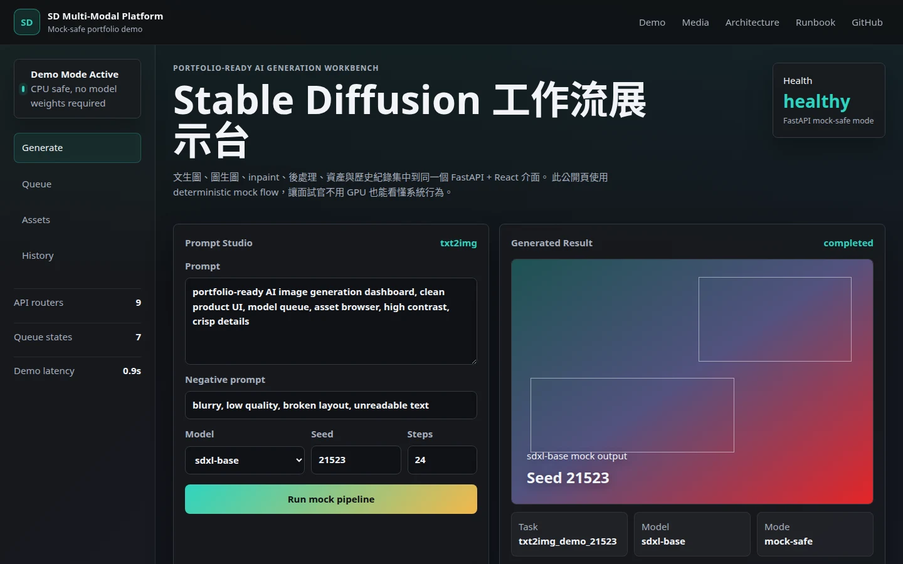
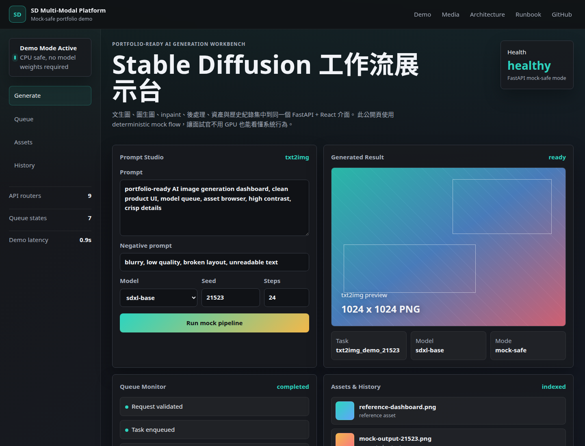
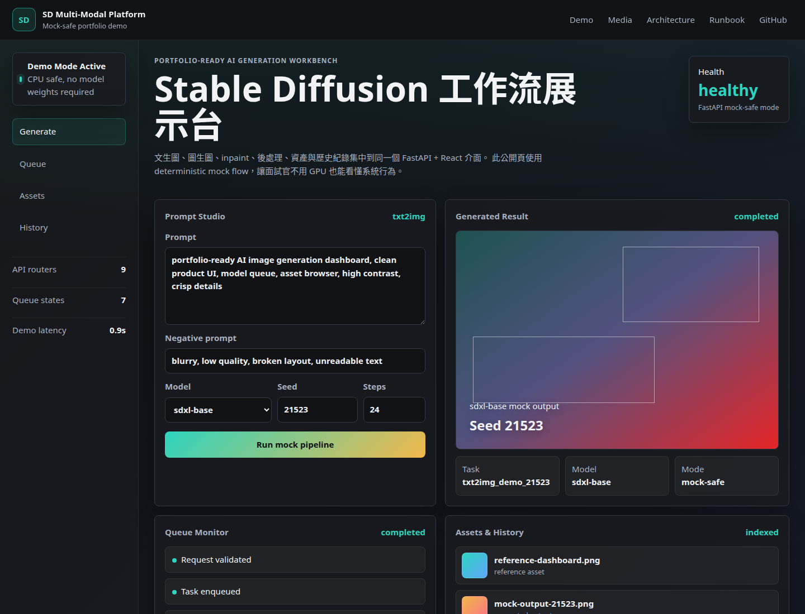
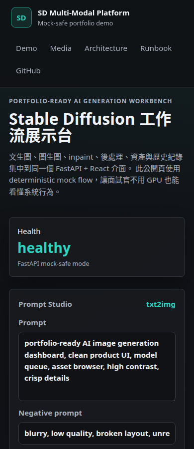
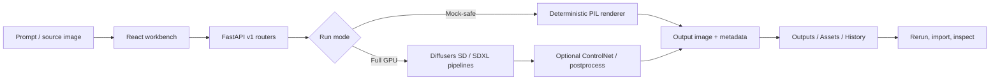
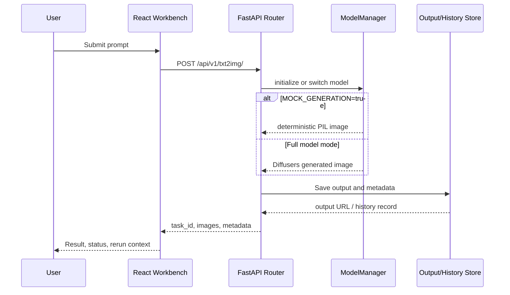
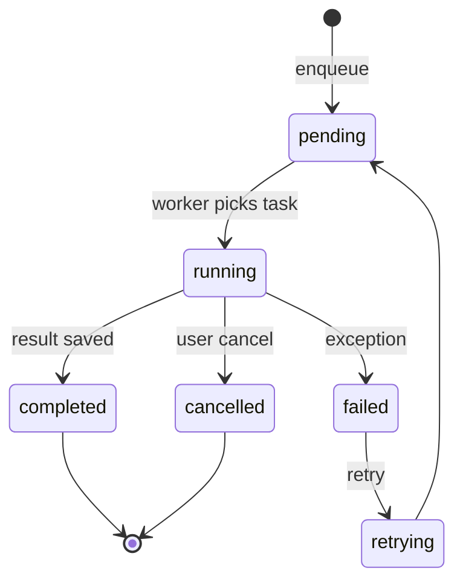
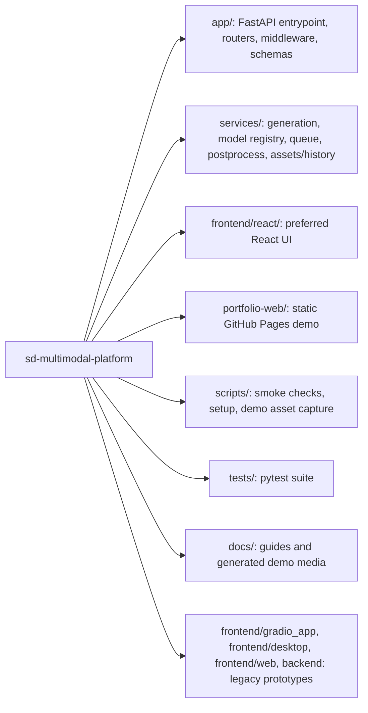
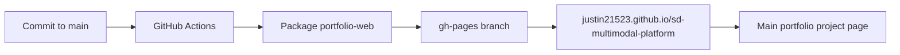

# SD Multi-Modal Platform

> Portfolio-ready Stable Diffusion platform demo: FastAPI backend, React workbench, Redis/Celery queue design, asset/history management, and a mock-safe public showcase that runs without GPU or model weights.

[Live demo](https://justin21523.github.io/sd-multimodal-platform/) · [Portfolio case study](https://justin21523.github.io/zh-TW/projects/sd-multimodal-platform/) · [API docs local](http://localhost:8000/api/v1/docs)



## What This Project Demonstrates

SD Multi-Modal Platform turns a local Stable Diffusion research stack into a product-shaped AI generation platform. The project is built around a FastAPI service, a React + TypeScript workbench, model routing, queue orchestration, output storage, reusable assets, and rerunnable history.

The public version is intentionally **mock-safe**. It demonstrates the full product flow without requiring private model weights, CUDA, Redis, or external services. Full Stable Diffusion mode remains available for local GPU environments that have the required model assets under `/mnt/c/ai_models`.

| Area | Demo-ready behavior | Full-mode extension |
| --- | --- | --- |
| Text-to-image | Deterministic PIL renderer through `/api/v1/txt2img/` | Diffusers SDXL / SD 1.5 pipelines |
| Image-to-image | Mock blend/stylization through `/api/v1/img2img/` | Diffusers img2img pipeline |
| Inpainting | Mask-composite mock renderer | Diffusers inpaint pipeline |
| Post-processing | Pillow/OpenCV fallback for smoke-safe runs | Real-ESRGAN / GFPGAN / CodeFormer |
| Queue | API degrades cleanly when Redis is absent | Redis + Celery generation/postprocess workers |
| Frontend | React workbench builds and can connect to mock API | Same UI against real local models |
| Public demo | GitHub Pages static interactive demo | Optional hosted API if a GPU/runtime host is available |

## Demo Screens

| Workbench | Generated result | Mobile |
| --- | --- | --- |
|  |  |  |

Demo video: [`docs/demo/demo/demo-walkthrough.webm`](docs/demo/demo/demo-walkthrough.webm)

## Product Flow



## Architecture

```mermaid
flowchart TB
    subgraph Client["Client Layer"]
      UI[React + TypeScript Vite Workbench]
      Static[GitHub Pages Portfolio Demo]
    end

    subgraph API["FastAPI Service"]
      MW[Logging / Auth / Rate Limit / CORS]
      R1[txt2img / img2img / inpaint]
      R2[upscale / face_restore]
      R3[assets / history / models / queue / health]
    end

    subgraph Services["Service Layer"]
      MM[ModelManager + ModelRegistry]
      AM[AssetManager]
      HS[HistoryStore]
      QM[QueueManager]
      PP[Postprocess services]
    end

    subgraph Runtime["Runtime / Storage"]
      Models[/mnt/c/ai_models]
      Cache[/mnt/c/ai_cache]
      Outputs[/mnt/data/.../outputs]
      Assets[/mnt/data/.../assets]
      Logs[/mnt/data/.../logs]
      Redis[(Redis optional)]
      Celery[Celery workers optional]
    end

    UI --> MW
    Static --> UI
    MW --> R1
    MW --> R2
    MW --> R3
    R1 --> MM
    R2 --> PP
    R3 --> AM
    R3 --> HS
    R3 --> QM
    MM --> Models
    MM --> Cache
    PP --> Outputs
    AM --> Assets
    HS --> Logs
    QM --> Redis
    Redis --> Celery
```

## API Request Sequence



## Queue Lifecycle



## Module Organization



## Data And Storage Layout

This repo follows `~/Desktop/data_model_structure.md`.

| Purpose | Path |
| --- | --- |
| Models | `/mnt/c/ai_models` |
| Hugging Face / Torch caches | `/mnt/c/ai_cache` |
| Generated outputs | `/mnt/data/training/runs/sd-multimodal-platform/outputs` |
| Uploaded/imported assets | `/mnt/data/training/runs/sd-multimodal-platform/assets` |
| Logs and history records | `/mnt/data/training/runs/sd-multimodal-platform/logs` |

```mermaid
flowchart TB
    Request[API request] --> Output[Generated output file]
    Request --> Metadata[Metadata JSON]
    Upload[User upload] --> Asset[Asset file + thumbnail]
    Output --> History[History JSON record]
    Metadata --> History
    Asset --> History
    Output --> Public[/outputs/* URL]
    Asset --> PublicAssets[/assets/* URL]
```

## Local Quick Start

### 1. Environment

```bash
conda activate ai_env
cp .env.example .env  # if present; never commit secrets

export HF_HOME=/mnt/c/ai_cache
export TRANSFORMERS_CACHE=/mnt/c/ai_cache
export TORCH_HOME=/mnt/c/ai_cache
export XDG_CACHE_HOME=/mnt/c/ai_cache
```

### 2. Mock-safe backend

```bash
AI_OUTPUT_ROOT=/tmp/sd-multimodal-platform-smoke \
MOCK_GENERATION=true MINIMAL_MODE=true DEVICE=cpu \
uvicorn app.main:app --reload --host 0.0.0.0 --port 8000
```

`AI_OUTPUT_ROOT` can be omitted on the primary workstation where `/mnt/data/training/runs/sd-multimodal-platform` is writable. The `/tmp` override keeps the public demo path reproducible on restricted laptops, CI runners, and interview machines.

Open:

- Health: `http://localhost:8000/api/v1/health`
- Docs: `http://localhost:8000/api/v1/docs`
- Outputs: `http://localhost:8000/outputs/*`
- Assets: `http://localhost:8000/assets/*`

### 3. React frontend

```bash
cd frontend/react
npm ci
VITE_API_BASE_URL=http://localhost:8000 npm run dev
```

Open `http://localhost:5173`.

### 4. Static portfolio demo

```bash
python -m http.server 4175 --directory portfolio-web
```

Open `http://localhost:4175`.

## Smoke And Build Checks

```bash
python scripts/check_paths.py
python -m compileall app services scripts utils
python -m pytest tests/test_phase2_api.py tests/test_path_invariants.py tests/test_postprocess_sync_history.py --no-cov -q

AI_OUTPUT_ROOT=/tmp/sd-multimodal-platform-smoke \
MOCK_GENERATION=true MINIMAL_MODE=true DEVICE=cpu \
uvicorn app.main:app --host 0.0.0.0 --port 8000

python scripts/smoke_api.py

cd frontend/react
npm ci
npm run typecheck
npm run build
```

Capture demo media:

```bash
python -m http.server 4175 --directory portfolio-web
python scripts/capture_demo_assets.py
```

## Full Model Mode

Full model mode requires local weights and sufficient GPU memory.

```bash
python scripts/install_models.py
uvicorn app.main:app --reload --host 0.0.0.0 --port 8000
```

Optional async queue:

```bash
redis-server
celery -A app.workers.celery_worker worker --loglevel=info --queues=generation,postprocess
```

## Deployment

The public static demo is suitable for GitHub Pages because it is self-contained and does not require a backend process.



For a live backend API, use Render, Railway, Fly.io, or a Docker host. GPU-backed full model mode should run on a machine with CUDA, model weights, and mounted `/mnt/c` + `/mnt/data` storage.

## Interview Demo Script

1. Open the live demo and show the first viewport. The product itself is visible immediately: prompt panel, generated result, queue monitor, assets/history.
2. Click `Run mock pipeline`. Explain that public demo mode is deterministic and GPU-free, while preserving the same UX and API concepts.
3. Scroll to Architecture. Connect React, FastAPI routers, ModelManager, queue, outputs/assets/history.
4. Open README diagrams. Point out degradation strategy: no Redis/model weights should not crash the service.
5. Run local smoke:

```bash
python scripts/smoke_api.py
```

6. Show React build:

```bash
cd frontend/react && npm run typecheck && npm run build
```

## What Is Complete

- FastAPI app boots in mock-safe mode.
- Health, model list, txt2img, img2img, assets/history, postprocess status, and queue degradation are testable.
- React + TypeScript frontend typechecks and builds.
- Static GitHub Pages demo is interactive and can be recorded.
- Demo screenshots and video assets are generated under `docs/demo/`.
- README contains architecture, data flow, queue lifecycle, deployment, and demo runbook diagrams.

## Current Risks And Boundaries

| Risk | Impact | Mitigation |
| --- | --- | --- |
| Full SD/SDXL needs model weights and GPU | Public demo cannot show true diffusion output | Mock-safe mode is clearly labeled; full mode instructions remain documented |
| Redis/Celery optional | Queue endpoints may return 503 locally | API degrades cleanly; smoke test accepts 503 for absent Redis |
| Postprocess libraries can conflict at import time | GFPGAN/basicsr may break app loading | Optional imports fall back to mock/fallback implementation |
| npm audit reports dependency issues | Vite dev dependencies may need future upgrade | Do not force breaking upgrades during demo stabilization; track as follow-up |

## Repository Notes

- Primary backend: `app/`
- Primary frontend: `frontend/react/`
- Public static demo: `portfolio-web/`
- Legacy prototypes: `backend/`, `frontend/web/`, `frontend/gradio_app/`, `frontend/desktop/`
- Large models, generated outputs, secrets, and private datasets must stay out of Git.
